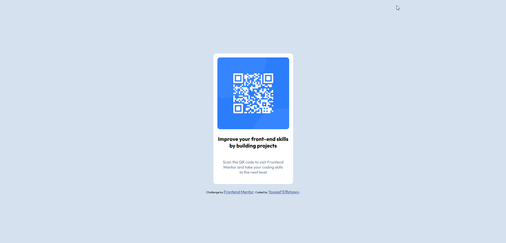
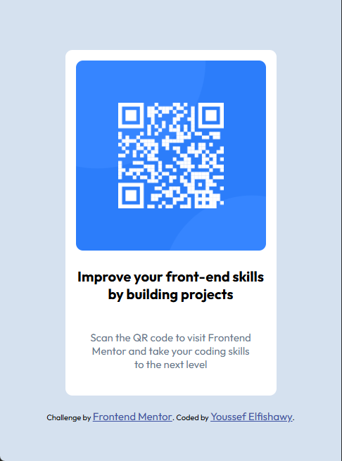

# Frontend Mentor - QR code component solution

This is a solution to the [QR code component challenge on Frontend Mentor](https://www.frontendmentor.io/challenges/qr-code-component-iux_sIO_H). Frontend Mentor challenges help you improve your coding skills by building realistic projects.

## Table of contents

- [Overview](#overview)
  - [Screenshot](#screenshot)
  - [Links](#links)
- [My process](#my-process)
  - [Built with](#built-with)
  - [What I learned](#what-i-learned)
  - [Continued development](#continued-development)
  - [Useful resources](#useful-resources)
- [Author](#author)
- [Acknowledgments](#acknowledgments)

**Note: Delete this note and update the table of contents based on what sections you keep.**

## Overview

### Screenshot

- Desktop Screen
  
- Mobile Screen
<p align="center">
  
</p>

### Links

- Solution URL: [Add solution URL here](https://your-solution-url.com)
- Live Site URL: [([https://your-live-site-url.com](https://youssefsafwat234.github.io/qr-code-component-mainfrontEndMentor-challenge/))

## My process

### Built with

- Semantic HTML5 markup
- CSS custom properties
- Flexbox
- Mobile-first workflow

### What I learned

While working on this project, I reinforced my understanding of semantic HTML structure and the importance of accessibility. I practiced using CSS Flexbox for layout and learned how to effectively use custom properties for consistent styling. I also improved my mobile-first workflow by starting with a responsive design and adjusting styles for larger screens.

**Example: Centering the QR code card with Flexbox**

```css
body {
  display: flex;
  justify-content: center;
  align-items: center;
  min-height: 100vh;
}
```

This project helped me appreciate the value of clean, maintainable code and the impact of small design details on the overall user experience.

### Continued development

Use this section to outline areas that you want to continue focusing on in future projects. These could be concepts you're still not completely comfortable with or techniques you found useful that you want to refine and perfect.

## Author

- LinkedIn - [Youssef Elfishawy](https://www.linkedin.com/in/youssef-elfishawy-4102241bb/)
- Frontend Mentor - [@youssefsafwat234](https://www.frontendmentor.io/profile/youssefsafwat234)

## Acknowledgments

This is where you can give a hat tip to anyone who helped you out on this project. Perhaps you worked in a team or got some inspiration from someone else's solution. This is the perfect place to give them some credit.
